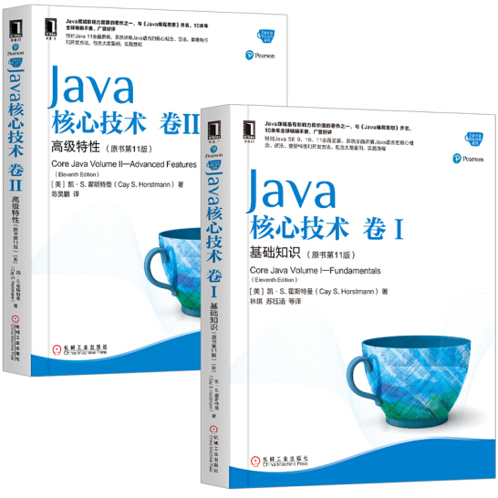

# core_java_reading_notes
#《Java核心技术》第11版 笔记

# 1. 图书资源
https://horstmann.com/corejava/

# 2. 《Java核心技术卷Ⅰ：基础知识 第11版》笔记
[第01章-Java程序设计概述](./notes/part1/第01章-Java程序设计概述.md)  
[第02章-Java程序设计环境](./notes/part1/第02章-Java程序设计环境.md)  
[第03章-Java基本程序设计结构](./notes/part1/第03章-Java基本程序设计结构.md)  
[第04章-对象和类](./notes/part1/第04章-对象和类.md)  
[第05章-继承](./notes/part1/第05章-继承.md)  
[第06章-接口、lambda表达式与内部接口](./notes/part1/第06章-接口、lambda表达式与内部接口.md)  
[第07章-异常、断言和日志](./notes/part1/第07章-异常、断言和日志.md)  
[第08章-泛型程序设计](./notes/part1/第08章-泛型程序设计.md)  
[第09章-集合](./notes/part1/第09章-集合.md)  
[第10章-图形用户界面程序设计](./notes/part1/第10章-图形用户界面程序设计.md)  
[第11章-Swing用户界面组件](notes/第11章-Swing用户界面组件.md)  
[第12章-并发](./notes/part1/第12章-并发.md)  

# 3. 《Java核心技术卷Ⅱ：高级特性 第11版》笔记
[第01章-Java8的流库](./notes/part2/第01章-Java8的流库.md)  
[第02章-输入与输出](./notes/part2/第02章-输入与输出.md)  
[第03章-XML](./notes/part2/第03章-XML.md)  
[第04章-网络](./notes/part2/第04章-网络.md)  
[第05章-数据库编程](./notes/part2/第05章-数据库编程.md)  
[第06章-日期和时间API](./notes/part2/第06章-日期和时间API.md)  
[第07章-国际化](./notes/part2/第07章-国际化.md)  
[第08章-脚本、编译和注解处理](./notes/part2/第08章-脚本、编译和注解处理.md)  
[第09章-Java平台模块系统](./notes/part2/第09章-Java平台模块系统.md)  
[第10章-安全](./notes/part2/第11章-安全.md)  
[第11章-高级Swing和图形化编程](./notes/part2/第12章-高级Swing和图形化编程.md)  
[第12章-本地方法](./notes/part2/第13章-本地方法.md)  

  